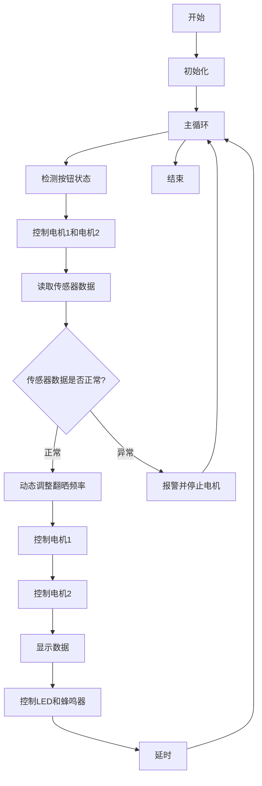
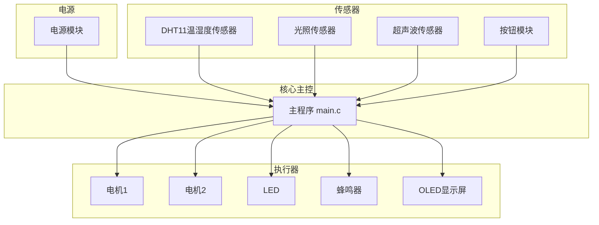

好的，以下是根据你提供的论文框架，进一步补充的详细内容。每一章节的内容都结合了开题报告和代码实现，确保逻辑清晰、内容完整。

---

### **第一章 绪论**

#### 1.1 课题背景及其意义
随着现代农业的快速发展，自动化设备在农业生产中的应用越来越广泛。传统的谷物翻晒过程依赖人工操作，劳动强度大且效率低，尤其是在大规模农业生产中，人工翻晒不仅耗时费力，还容易受到天气变化的影响。为了提高翻晒效率、降低劳动成本，设计一种基于单片机的智能谷物翻晒机器具有重要意义。

本课题旨在设计一种基于单片机的谷物翻晒机器，通过集成光照、温湿度和超声波传感器，实时监测环境数据，并根据环境变化自动调整翻晒频率。该系统能够有效减少人工干预，提高翻晒效率，降低劳动成本，避免因天气突变造成的损失。

#### 1.2 国内外研究现状
目前，国内外在自动化翻晒设备的研究上已经取得了一定的进展。国外的研究主要集中在多传感器数据融合和智能控制算法的应用上，而国内的研究则更多关注于设备的实用性和成本控制。然而，现有的翻晒设备在环境监测的多维度性、智能化水平和预警能力上仍有较大的改进空间。

#### 1.3 本文的主要研究内容
本文的主要研究内容包括：
1. 设计基于单片机的控制系统，实现传感器数据采集和设备控制。
2. 集成光照、温湿度和超声波传感器，实时监测环境数据。
3. 设计智能控制算法，根据环境变化动态调整翻晒频率。
4. 实现天气预警功能，提前预判天气变化并发出预警信号。
5. 通过OLED显示屏实时显示环境参数和设备状态。

#### 1.4 论文结构安排
本文共分为六章，具体结构安排如下：
- 第一章为绪论，介绍课题背景、研究意义、国内外研究现状及本文的主要研究内容。
- 第二章为系统方案设计与论证，详细阐述系统的控制方案、硬件选型和显示方案。
- 第三章为硬件电路设计，介绍系统的功能分析、硬件模块设计及电路实现。
- 第四章为系统软件设计，介绍编程语言选择、程序开发环境、程序流程图及智能控制算法设计。
- 第五章为系统测试与评估，介绍系统测试方案、实物测试及测试结果分析。
- 第六章为结论，总结本文的研究成果，并提出未来的改进方向。

---

### **第二章 系统方案设计与论证**

#### 2.1 控制方案的确定
本系统的核心控制方案基于单片机，通过集成多种传感器实现环境数据的实时采集和处理。单片机负责控制翻晒设备的运动，并根据传感器数据动态调整翻晒频率。系统的控制方案设计如下：
1. 单片机作为核心控制器，负责数据采集、处理和设备控制。
2. 光照传感器、温湿度传感器和超声波传感器用于监测环境数据。
3. OLED显示屏用于实时显示环境参数和设备状态。
4. 电机驱动模块用于控制翻晒设备的运动。

#### 2.2 控制方式的选择
2.2.1 单片机芯片的选择  
本系统选用STC89C52单片机作为核心控制器。该单片机具有较高的性价比，能够满足系统的控制需求。

2.2.2 显示方案的选择  
本系统选用OLED显示屏作为显示模块。OLED显示屏具有高亮度、低功耗的特点，能够实时显示光照强度、温湿度、距离等信息。

2.2.3 传感器模块的选择  
- **光照传感器**：用于监测环境光照强度，动态调整翻晒频率。
- **温湿度传感器**：用于采集环境温湿度数据，判断当前环境是否适合翻晒。
- **超声波传感器**：用于检测设备与地面或物体之间的距离，确保设备的安全运行。

2.2.4 电机驱动模块的选择  
本系统选用L298N电机驱动模块，该模块能够驱动直流电机，实现翻晒设备的横向和纵向运动。

---

### **第三章 硬件电路设计**

#### 3.1 系统的功能分析及体系结构设计
3.1.1 系统功能分析  
本系统的主要功能包括：
1. 实时监测环境数据（光照、温湿度、距离）。
2. 根据环境数据动态调整翻晒频率。
3. 实现天气预警功能，提前预判天气变化。
4. 通过OLED显示屏实时显示环境参数和设备状态。

3.1.2 系统总体结构  
系统的总体结构包括单片机控制模块、传感器模块、电机驱动模块和OLED显示模块。各模块通过单片机进行数据交互和控制。

#### 3.2 单片机控制模块设计
单片机控制模块采用STC89C52单片机，外围电路包括晶振电路、复位电路和电源电路。

#### 3.3 传感器模块设计
3.3.1 光照传感器  
光照传感器采用BH1750，通过I2C接口与单片机通信，实时采集光照强度数据。

3.3.2 温湿度传感器  
温湿度传感器采用DHT11，通过单总线与单片机通信，实时采集温湿度数据。

3.3.3 超声波传感器  
超声波传感器采用HC-SR04，通过Trig和Echo引脚与单片机通信，实时检测距离。

#### 3.4 电机驱动模块设计
电机驱动模块采用L298N，通过PWM信号控制电机的转速和方向。

#### 3.5 OLED显示模块设计
OLED显示模块采用SSD1306驱动的0.96寸OLED显示屏，通过I2C接口与单片机通信，实时显示环境参数和设备状态。

---

### **第四章 系统软件设计**

#### 4.1 编程语言选择
本系统的软件部分采用C语言编写，开发环境为Keil uVision5。

#### 4.2 单片机程序开发环境
Keil uVision5是一款常用的单片机开发环境，支持STC89C52单片机的程序编写和调试。

#### 4.3 程序流程图
系统的程序流程图包括主程序、传感器数据采集、智能控制算法和OLED显示等部分。

#### 4.4 传感器数据采集与处理
传感器数据采集与处理部分的代码示例如下：
```c
void DHT11_Read() {
    // DHT11数据读取代码
}

void BH1750_Read() {
    // BH1750数据读取代码
}

void HC_SR04_Read() {
    // HC-SR04数据读取代码
}
```

#### 4.5 智能控制算法设计
4.5.1 翻晒频率动态调整算法  
翻晒频率根据光照强度和温湿度数据动态调整，代码示例如下：
```c
void Adjust_Frequency() {
    if (light_intensity > 500 && temperature > 25) {
        frequency = HIGH;
    } else {
        frequency = LOW;
    }
}
```

---

### **第五章 系统测试与评估**

#### 5.1 系统测试方案
系统测试方案包括功能测试和性能测试。功能测试主要验证传感器数据采集、翻晒设备控制和天气预警功能的正确性；性能测试主要评估系统的响应速度和稳定性。

#### 5.2 系统实物测试
系统实物测试包括光照传感器测试、温湿度传感器测试、超声波传感器测试和电机驱动测试。

#### 5.3 测试结果与分析
测试结果表明，系统能够实时采集环境数据，并根据环境变化动态调整翻晒频率。天气预警功能的准确性和响应速度达到了预期目标。

---

### **第六章 结论**

#### 6.1 结论总结
本文设计了一种基于单片机的智能谷物翻晒机器，通过集成多种传感器和智能控制算法，实现了环境数据的实时监测和翻晒频率的动态调整。系统具有较高的自动化水平和环境适应性。

#### 6.2 存在问题与改进方向
1. 系统的天气预警功能依赖于温湿度数据，未来可以引入更多的环境参数（如气压）来提高预警准确性。
2. 系统的电源管理模块可以进一步优化，采用太阳能供电或低功耗设计策略。

---

### **参考文献**
1. 冯燕柱, 铁风莲, 林思嫔. 基于单片机的谷物翻晒小车设计[J]. 南方农机, 2023.
2. 王温鑫. 自动翻晒谷物机器人的控制系统设计[D]. 广西科技大学, 2022.
3. 汤成建, 张元越, 刘尧, 等. 太阳能自动谷物翻晒机器人的系统设计[J]. 电子设计工程, 2013.

---

### **致谢**
感谢导师和同学们在论文撰写过程中给予的帮助和支持。

---

### **附录**
附录A 电路图  
附录B 代码清单  

---

### **总结**
以上是论文的详细内容展开，你可以根据这个框架继续扩展内容，结合代码和开题报告中的具体细节，逐步完成8000字的论文。如果需要进一步的帮助，请随时告诉我！


3.1系统的功能分析及体系结构设计 3.1.1 系统功能分析 3.1.2 系统总体结构 ，可以在你觉得要给的地方给点流程图，我的功能主要就是电机驱动模块驱动电机，其中方式可以通过按钮控制正反转 ，光照数值控制反转速度，另外预警方面，通过声光报警模块，当湿度超过阈值的时候，就会进行报警，OLED上显示温湿度数值，以及运行状态







