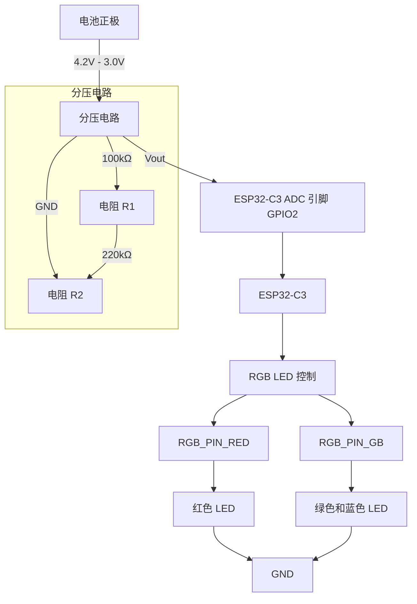

#include <Wire.h>
#include <BleCombo.h>
#include "mpu6500.h"

// MPU6500 对象
bfs::Mpu6500 imu(&Wire, bfs::Mpu6500::I2C_ADDR_PRIM);

// 灵敏度档位设置
int sensitivityLevel = 0;  // 灵敏度档位 (0-3)，初始设置为0档
const float MOUSE_SENSITIVITY[] = {800, 1600, 3200, 6400};  // 灵敏度值
const float MOVE_THRESHOLD[] = {0.1, 0.2, 0.2, 0.2};  // 每个档位的最小变化阈值
const float SMOOTHING_FACTOR[] = {0.7, 0.5, 0.3, 0.2};  // 平滑因子

// RGB LED 引脚定义
#define RED_PIN    5
#define GREEN_PIN  6
#define BLUE_PIN   7

// 按钮引脚定义
#define BUTTON_PIN_1 4  // 切换灵敏度
#define BUTTON_PIN_2 3  // 发送上键
#define BUTTON_PIN_3 2  // 发送下键
#define BUTTON_PIN_4 1  // 发送左键
#define BUTTON_PIN_5 0  // 发送 Win + D

// 陀螺仪数据平滑
float smoothedGyroX = 0, smoothedGyroY = 0, smoothedGyroZ = 0;

// 按钮状态
/*
bool buttonPressed1 = false, buttonPressed2 = false, buttonPressed3 = false, buttonPressed4 = false, buttonPressed5 = false;
bool lastButtonState1 = HIGH, lastButtonState2 = HIGH, lastButtonState3 = HIGH, lastButtonState4 = HIGH, lastButtonState5 = HIGH;
unsigned long lastDebounceTime1 = 0, lastDebounceTime2 = 0, lastDebounceTime3 = 0, lastDebounceTime4 = 0, lastDebounceTime5 = 0;
const unsigned long debounceDelay = 50;  // 去抖动延时（毫秒）
*/
// 初始化 MPU6500
void initMPU6500() {
    Wire.begin();
    if (!imu.Begin()) {
        Serial.println("Error initializing MPU6500");
        while (1);
    }
    Serial.println("MPU6500 initialized successfully");
}

// 设置 RGB LED 颜色
void setRGBColor(uint8_t red, uint8_t green, uint8_t blue) {
    analogWrite(RED_PIN, red);
    analogWrite(GREEN_PIN, green);
    analogWrite(BLUE_PIN, blue);
}

// 计算角度变化并移动鼠标
void gyroToMouseMovement() {
    static int64_t lastTime = 0;
    int64_t currentTime = micros();
    int64_t timeDiff = currentTime - lastTime;
    lastTime = currentTime;

​    if (timeDiff > 100000) timeDiff = 100000;  // 限制最大时间差

​    if (imu.Read()) {
​        float gyroX = imu.gyro_x_radps();
​        float gyroY = imu.gyro_y_radps();
​        float gyroZ = imu.gyro_z_radps();

​        // 计算角度变化
​        float angleX = (timeDiff / 1000000.0) * gyroX;
​        float angleY = (timeDiff / 1000000.0) * gyroY;
​        float angleZ = (timeDiff / 1000000.0) * gyroZ;

​        // 平滑数据
​        smoothedGyroX = smoothedGyroX * SMOOTHING_FACTOR[sensitivityLevel] + angleX * (1 - SMOOTHING_FACTOR[sensitivityLevel]);
​        smoothedGyroY = smoothedGyroY * SMOOTHING_FACTOR[sensitivityLevel] + angleY * (1 - SMOOTHING_FACTOR[sensitivityLevel]);
​        smoothedGyroZ = smoothedGyroZ * SMOOTHING_FACTOR[sensitivityLevel] + angleZ * (1 - SMOOTHING_FACTOR[sensitivityLevel]);

​        // 检查是否超过阈值
​        if (abs(smoothedGyroX) >= MOVE_THRESHOLD[sensitivityLevel] || 
​            abs(smoothedGyroY) >= MOVE_THRESHOLD[sensitivityLevel] || 
​            abs(smoothedGyroZ) >= MOVE_THRESHOLD[sensitivityLevel]) {

​            // 计算鼠标移动
​            int mouseX = smoothedGyroZ * MOUSE_SENSITIVITY[sensitivityLevel];  // Z 轴控制水平
​            int mouseY = -smoothedGyroY * MOUSE_SENSITIVITY[sensitivityLevel]; // Y 轴控制垂直

​            // 移动鼠标
​            if (Keyboard.isConnected()) {
​                Mouse.move(mouseX, mouseY);
​            }

​            // 调试信息
​            Serial.printf("Gyro X: %.2f, Y: %.2f, Z: %.2f | Mouse X: %d, Y: %d\n", gyroX, gyroY, gyroZ, mouseX, mouseY);
​        }
​    }
}
/*
// 处理按钮输入
void handleButtonInput(int buttonPin, bool &buttonPressed, bool &lastButtonState, unsigned long &lastDebounceTime, void (*action)()) {
​    int buttonState = digitalRead(buttonPin);  // 读取按钮状态

​    // 检查按钮状态是否发生变化
​    if (buttonState != lastButtonState) {
​        lastDebounceTime = millis();  // 记录状态变化的时间
​    }

​    // 如果按钮状态稳定超过去抖动时间
​    if ((millis() - lastDebounceTime) > debounceDelay) {
​        // 如果按钮状态发生变化
​        if (buttonState != buttonPressed) {
​            buttonPressed = buttonState;

​            // 如果按钮按下（低电平）
​            if (buttonPressed == LOW) {
​                action();  // 执行按钮对应的操作
​            }
​        }
​    }

​    lastButtonState = buttonState;  // 更新上一次按钮状态
}
*/
/*
// 按钮 1 操作：切换灵敏度
void button1Action() {
​    sensitivityLevel = (sensitivityLevel + 1) % 4;
​    Serial.print("Sensitivity level: ");
​    Serial.println(sensitivityLevel);

​    // 根据灵敏度档位更新RGB灯颜色
​    switch (sensitivityLevel) {
​        case 0: setRGBColor(255, 0, 0); break;  // 红色
​        case 1: setRGBColor(0, 255, 0); break;  // 绿色
​        case 2: setRGBColor(0, 0, 255); break;  // 蓝色
​        case 3: setRGBColor(255, 255, 255); break;  // 白色
​    }
}

// 按钮 2 操作：发送上键
void button2Action() {
    Keyboard.write(KEY_UP_ARROW);
    Serial.println("Up key sent!");
}

// 按钮 3 操作：发送下键
void button3Action() {
    Keyboard.write(KEY_DOWN_ARROW);
    Serial.println("Down key sent!");
}

// 按钮 4 操作：发送左键点击
void button4Action() {
    Mouse.click(MOUSE_LEFT);
    Serial.println("Left mouse button clicked!");
}

// 按钮 5 操作：发送 Win + D
void button5Action() {
    Keyboard.press(KEY_LEFT_GUI);
    Keyboard.press('d');
    delay(100);
    Keyboard.releaseAll();
    Serial.println("Win + D sent!");
}
*/
void setup() {
    Serial.begin(115200);
    Serial.println("Starting ESP32 Air Mouse...");

​    // 初始化 MPU6500
​    initMPU6500();

​    // 初始化蓝牙键盘和鼠标
​    Wire.begin();
​    Keyboard.begin();
​    Mouse.begin();
/*
​    // 初始化按钮引脚
​    pinMode(BUTTON_PIN_1, INPUT_PULLUP);
​    pinMode(BUTTON_PIN_2, INPUT_PULLUP);
​    pinMode(BUTTON_PIN_3, INPUT_PULLUP);
​    pinMode(BUTTON_PIN_4, INPUT_PULLUP);
​    pinMode(BUTTON_PIN_5, INPUT_PULLUP);

​    // 初始化 RGB LED 引脚
​    pinMode(RED_PIN, OUTPUT);
​    pinMode(GREEN_PIN, OUTPUT);
​    pinMode(BLUE_PIN, OUTPUT);
​    */
}

void loop() {
    // 处理陀螺仪数据并移动鼠标
    if (Keyboard.isConnected()) {
        gyroToMouseMovement();
    }
/*
    // 处理按钮输入
    handleButtonInput(BUTTON_PIN_1, buttonPressed1, lastButtonState1, lastDebounceTime1, button1Action);  // 按钮 1
    handleButtonInput(BUTTON_PIN_2, buttonPressed2, lastButtonState2, lastDebounceTime2, button2Action);  // 按钮 2
    handleButtonInput(BUTTON_PIN_3, buttonPressed3, lastButtonState3, lastDebounceTime3, button3Action);  // 按钮 3
    handleButtonInput(BUTTON_PIN_4, buttonPressed4, lastButtonState4, lastDebounceTime4, button4Action);  // 按钮 4
    handleButtonInput(BUTTON_PIN_5, buttonPressed5, lastButtonState5, lastDebounceTime5, button5Action);  // 按钮 5
*/
    // 小延时
    delay(10);
}

螺丝

https://detail.tmall.com/item.htm?spm=a21n57.1.item.1.6fe4523clsryh9&priceTId=213e384b17377150476062087ea2d4&utparam=%7B%22aplus_abtest%22%3A%22d2b161ee0ae0e77f69384a4c9fcd1582%22%7D&id=732574392134&ns=1&xxc=ad_ztc&skuId=5245471699344&pisk=g0xre5wwo0nzbVJwGhjUbSlY9GIR-Mls4H1CKpvhF_flNpXhYIAIe_9nwB-FipLSewG8L8K2_kZSw4p3YMsn1fisfLp5vMc_W-hTC7BCBumC-_vc29_-GxNjfLpR98PnCEm_T6Obh84htBjco9WlxTbltrDVdO4hx_b3irXGiMfHt_40iOWGKzfl-iDVI9B3rufhimXFLuqHtMD2nsBhxTcYXwba09boKSEjoEyotwfMEsr3bRBPrJpzRkZBmT7yxL5VhttVUa5NkUbtE3AXK3tRkVU1vKTwTeAm0uReEFAhNncgY6TOGZxktceNi3Je0aLbZzXN4_7MqZ2z4K7HunSWqXU9hK5l7iTjkb_C4Q8O6a0xMBJVNBxPo7lfOF9XqZRiGoRd8UAPnGjzEWBcWF-pzW4FrtBV1xk24-hHytxRoUaLJaNA31MPUyUdrtBV1xk4JyQSWt5sUT5..

端子

https://detail.tmall.com/item.htm?priceTId=2147837e17377152178647353e18e2&utparam=%7B%22aplus_abtest%22%3A%226bf7ac8964ba322e7ebd0cf031cd1f27%22%7D&id=555972961715&ns=1&xxc=ad_ztc&skuId=3600829826835&spm=a21n57.1.hoverItem.1&pisk=gIpKeLj0zV03kr0x8plGqz4W1ciiwfxE-e-bEab3NFL9VN2oY9cPeUQ9zwfhdw2Re3LyrUKrYg_WPUQktfDDYHWPFqb-nxxUi54bueCQOli52i7Sj6apA9rCFq0me5q1T2XW-RKlyAN10NsCV_wSXOsRmg65NMtsXgsuR7wBPcK17gP7Rg_51Rs5qM65AMwsCisuA71QdOw17g65PU6SXOGv6JQ8AZwJMWVHHrUbRJ2HBMCdy8XUeUJgn1QXONwSldSLuZtCW8wR-dwiLhKnJ--GLdYAmeD_pEKBGUOX5Aed_Bt9esJz0R-9cCAc9C3QeNvh2s656uwWX9_5Gp6jhPIw1HAWLeE8FMJHn_QV60wPZO9cGITL4m-1dgTPgL04LwtW0KRcHYe1p_srQKvxBKackgVIXcFza6swTMXvy7vivHIOoc8aa75sbGQmXcFza6sNXZmNg7PP1c5..